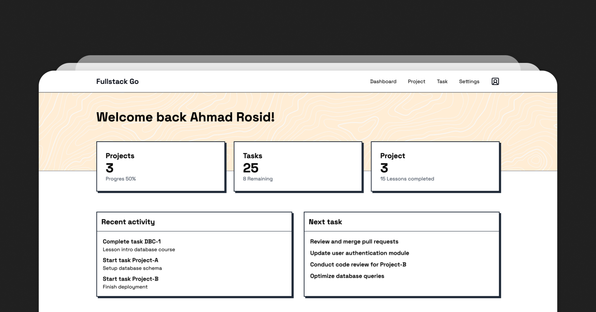

# Go Fullstack Pocketbase with Svelte



## Overview

This project is template of a fullstack application built with Go, Pocketbase, and Svelte. It showcases how to integrate these technologies to create a modern, efficient web application.

## Features

- Backend powered by Go and Pocketbase
- Frontend built with Svelte
- Seamless integration between frontend and backend
- Easy-to-use Makefile for common operations

## Prerequisites

Before you begin, ensure you have the following installed:
- Go (1.16 or later)
- Node.js (14.x or later)
- npm (6.x or later)

## Getting Started

1. Clone the repository:
   ```
   git clone https://github.com/ahmadrosid/go-fullstack-svelte.git
   cd go-fullstack-svelte
   ```

2. Install frontend dependencies:
   ```
   cd ui
   npm install
   ```

3. Build the frontend:
   ```
   npm run build
   cd ..
   ```

4. Run the application:
   ```
   go run main.go serve --publicDir=ui/dist
   ```

5. Open your browser and navigate to `http://localhost:8090` (or the port specified in the console output).

## Development

For development, you can use the following commands:

- To run the backend:
  ```
  go run main.go serve
  ```

- To run the frontend in development mode (in the `ui` directory):
  ```
  npm run dev
  ```

## Project Structure

- `/ui`: Contains the Svelte frontend application
- `main.go`: Entry point for the Go backend
- `Makefile`: Contains useful commands for building and running the project

## Contributing

Contributions are welcome! Please feel free to submit a Pull Request.

## License

This project is open source and available under the [MIT License](LICENSE).

## Acknowledgements

- [Pocketbase](https://pocketbase.io/)
- [Svelte](https://svelte.dev/)
- [Go](https://golang.org/)
